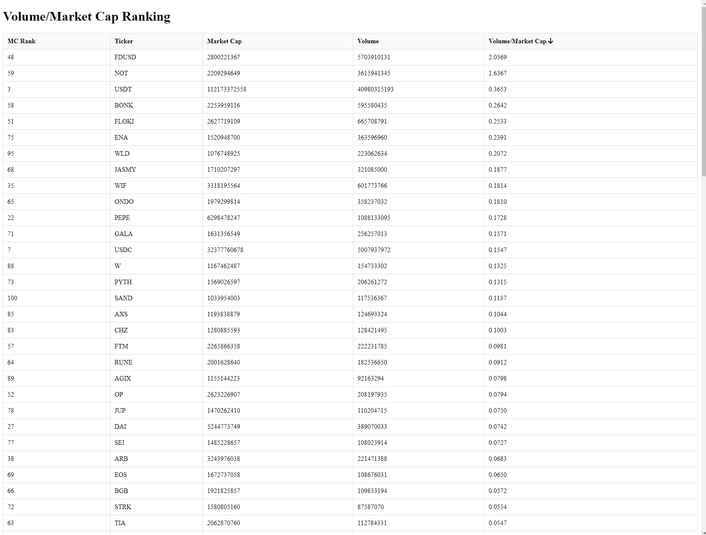

# Volume/Market Cap Ranking

## ChatGPT Documentation Process
For detailed documentation on the development process, you can refer to the conversation with ChatGPT here: [ChatGTP chat link](https://chatgpt.com/c/ffdfea29-b935-4860-b861-5daab8889ea7)

## Description
This application fetches and displays the top X cryptocurrencies based on volume/market cap ratio. You can specify the number of cryptocurrencies to retrieve by adding a `coins` parameter to the URL. For example, to get the top 100 cryptocurrencies, you can use `http://localhost:3000?coins=100`.

The table includes the following columns:
- **MC Rank**: Market Cap Rank
- **Ticker**: Ticker symbol of the cryptocurrency
- **Market Cap**: Market capitalization of the cryptocurrency
- **Volume**: 24-hour trading volume of the cryptocurrency
- **Volume/Market Cap**: Ratio of 24-hour trading volume to market capitalization

The column headers are clickable, allowing you to sort the data in ascending or descending order based on the selected column.

## MIT License
This project is licensed under the MIT License. 

## Done with <3 and ChatGPT in 1h

